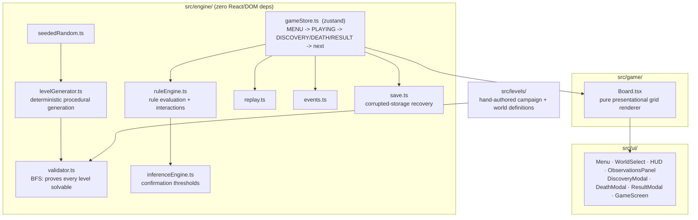

<p align="center"></p>

<div align="center">

# RULESHIFT

**The world has rules. You just don't know them yet.**

A small robot. A grid. An exit. Simple, until the blue orb you touched two
moves ago quietly turns the red one lethal, or dying once flips which way is up.

[](https://jeevan-0508.github.io/ruleshift/)
[](LICENSE)
[](src/tests)
[](#architecture)

</div>

RULESHIFT is a puzzle game about figuring out rules nobody told you, built so
that every surprise has a fair, discoverable explanation.

---

## Why does this exist?

Most puzzle games show you the mechanic on screen: a block, a switch, a
color code. RULESHIFT hides the mechanic *in the interactions between
objects* and asks you to reconstruct it from evidence, the way you'd debug an
unfamiliar system. The fun is entirely in the gap between "wait, what just
happened?" and "ohhh, I get it now" — and the engineering underneath exists
to make sure that gap is always fair, never cheap.

## The rule engine

Every hidden rule is data, not a special-cased function:

```ts
{
  trigger: 'PLAYER_TOUCH',
  condition: { objectKind: 'BLUE' },
  target: 'RED',
  effect: 'BECOME_DANGEROUS',
  description: 'Touching blue makes red dangerous.'
}
```

`RuleEngine` (`src/engine/ruleEngine.ts`) evaluates these against a running
world state on every move: touches, timers, death counts, and move direction
can all be triggers; targets can be an object kind, the player, or the exit;
effects range from `BECOME_DANGEROUS` to `REVERSE_GRAVITY` to `MOVE_EXIT`.
Rules compose freely — one rule's effect can set up the condition for
another — which is what produces emergent, learnable behavior instead of a
list of one-off scripted events.

## Deterministic procedural generation

`generateLevel(seed, world, difficulty, ruleCount)` (`src/engine/levelGenerator.ts`)
uses a seeded PRNG (`mulberry32`, `src/engine/seededRandom.ts`) for every
random decision: grid size, object placement, which rule templates get
instantiated, teleport destinations. Same seed in, byte-identical level out,
forever — verified in `src/tests/levelGenerator.test.ts`. The **Daily
Challenge** seed is derived from the UTC calendar date (`dailySeed()`), so
everyone playing on a given day gets the same world.

## Level validation

A generated level is only as good as its guarantee that it can actually be
solved. `validateLevel()` (`src/engine/validator.ts`) runs a real breadth-first
search **over the actual `RuleEngine`** — not a simplified graph — trying all
four directions from every reachable state, where "state" includes player
position, cumulative deaths, gravity, and which objects are alive/dangerous.
If a generated level comes back unsolvable, the generator discards it and
retries with a derived seed before falling back to a known-good level. This
means procedural generation is *validated* generation, not merely "random and
hope for the best."

## Inference, not exposition

The game never tells you a rule outright. `InferenceEngine`
(`src/engine/inferenceEngine.ts`) reads the deterministic event log, matches
touch → rule-trigger sequences, and only promotes an observation to a
"discovery" once it's been evidenced more than once. A single unlucky death
never unlocks a hidden mechanic — the sidebar's **Your Observations** panel
stays honestly uncertain (`?`) until you do.

## Fairness

Rules are allowed to look contradictory as long as another rule explains the
contradiction — e.g. red is only dangerous *after* blue was touched. The
generator never produces a level where the only path to the exit requires
knowledge the player couldn't have had; `validateLevel` proves a solution
exists, and the hand-authored campaign levels are built so an alternate,
rule-ignorant route always exists too (see `src/tests/ruleEngine.test.ts`,
*"lets the player walk past red safely if blue was never touched"*).

## Replay

Every run is a list of moves plus a deterministic event log. `replayRun()`
(`src/engine/replay.ts`) re-simulates a recorded move list from a fresh
engine and reproduces the exact same event sequence — this is both the
in-game **Watch Replay** feature and a correctness check
(`verifyReplayDeterminism`, exercised in `src/tests/replay.test.ts`).

## Architecture



The engine (`src/engine/`) has zero React or DOM dependencies — it's plain
TypeScript, fully unit-testable, and the same code could drive a CLI, a
different renderer, or a server-side validity checker. State lives in one
`zustand` store (`gameStore.ts`) that owns the phase machine
(`MENU → PLAYING → DISCOVERY/DEATH/RESULT → next`); there is no scattered
global state.

## Testing

```bash
bun run test        # vitest, 27+ tests across every engine module
bun run typecheck    # tsc --noEmit
bun run build        # production build
```

Covered: PRNG determinism, rule evaluation and interactions, death/respawn
(and that deaths persist across respawns while world flags reset), wall
collision, teleport, gravity reversal, replay-matches-original, inference
confirmation thresholds, save/load including corrupted-storage recovery,
and — critically — that every hand-authored and generated level is proven
solvable by the BFS validator.

## Performance

Rendering is a flat grid of `<div>`s driven by one `zustand` selector per
component (no prop-drilling, no unnecessary re-renders of the whole board on
every tick). The game loop uses a single `requestAnimationFrame` for the
timer tick, cleaned up on unmount. The event log is per-attempt, not
global-unbounded — it resets on respawn.

## Roadmap

- Worlds 3–5 (Double Reality, Causality, Unknown) — currently locked, spec'd
  in `src/levels/handAuthored.ts` (`WORLDS`)
- Player hypothesis system ("I think blue is safe") with explicit
  confirm/revise UI
- Procedural OBJECT_TOUCH interactions (moving hazards, not just static ones)
- Lightweight procedural sound (movement, teleport, discovery, death)
- Optional online leaderboard for the Daily Challenge (local best score only
  today; `save.ts` schema is already keyed to support it)

## Tech

TypeScript, React 19, Vite, zustand, vitest — no backend, no accounts.
Progress and best times are saved to `localStorage`
(`src/engine/save.ts`), with graceful fallback if storage is corrupted or
unavailable.
